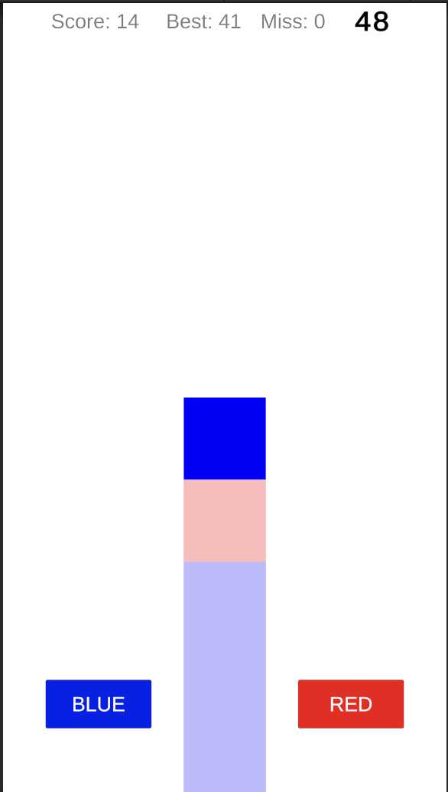
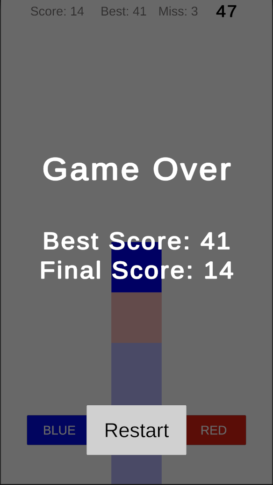

# Color Sorter Mini Game

간단한 클릭 분류 게임  
레인에 내려오는 블록을 색에 맞게 분류하여 점수를 획득하고, 최고 점수를 갱신할 수 있다.

  
  

---

## Features

- 단일 레인 기반의 간단한 컬러 분류 게임
- MVC 구조 기반 설계로 UI와 게임 로직 분리
- 최고 점수 자동 저장 (PlayerPrefs)
- ScriptableObject 기반 게임 설정값 분리
