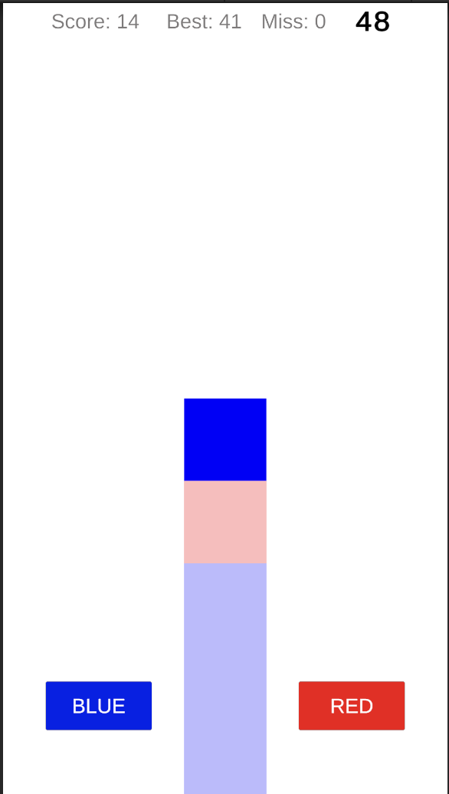
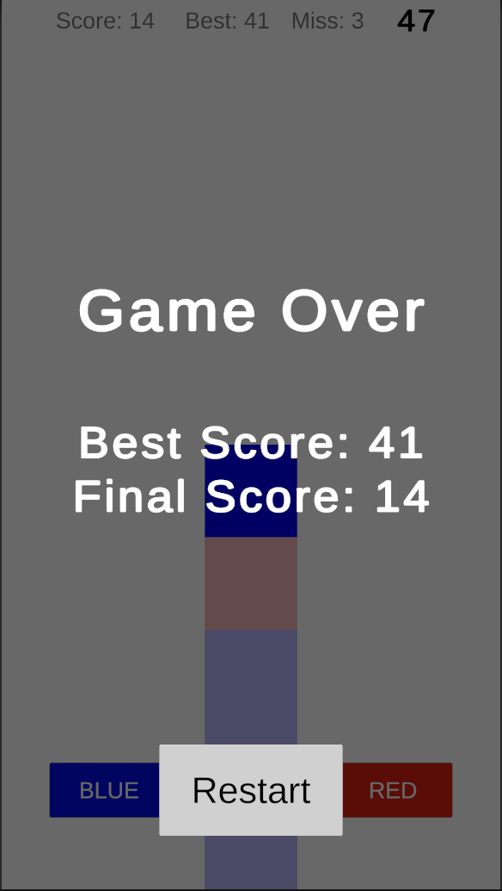

# Color Sorter

Unity로 제작한 간단한 컬러 분류 미니게임입니다.

레인에 표시되는 블록의 색상에 맞는 버튼을 선택해 점수를 획득하며,
제한 시간과 허용된 실수 횟수 내에서 최고 점수 갱신을 목표로 합니다.

  
  

---

## Features

- 게임 로직과 UI 분리
- ScriptableObject 기반 게임 설정 관리
- PlayerPrefs 기반 최고 점수 저장
- 인터페이스를 통한 난수 생성 및 저장 기능 분리

## Structure

- `Game` - 게임 상태 및 규칙
- `Controller` - 게임 흐름 및 ViewData 관리
- `View` - Board, HUD, GameOver UI
- `Services` - Random, HighScore 구현
- `Abstractions` - 서비스 인터페이스
- `Data` - GameConfig, SpawnTable
